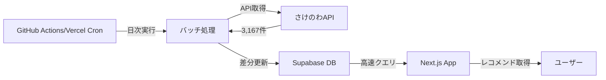

# バッチ処理によるSupabase DB同期方式の設計書

## 概要
さけのわAPIから定期的にデータを取得し、Supabaseのデータベースに格納する方式の詳細設計。

## アーキテクチャ



## 1. データベース設計

### 新規テーブル: `sake_master`

```sql
-- 日本酒マスターテーブル
CREATE TABLE sake_master (
  id VARCHAR(50) PRIMARY KEY,
  brand_id INTEGER NOT NULL,
  brand_name VARCHAR(255) NOT NULL,
  brewery_id INTEGER NOT NULL,
  brewery_name VARCHAR(255) NOT NULL,
  
  -- 味わい座標（-3 to +3）
  sweetness FLOAT DEFAULT 0,
  richness FLOAT DEFAULT 0,
  
  -- フレーバーチャート（0 to 1）
  f1_floral FLOAT DEFAULT 0.5,
  f2_mellow FLOAT DEFAULT 0.5,
  f3_heavy FLOAT DEFAULT 0.5,
  f4_mild FLOAT DEFAULT 0.5,
  f5_dry FLOAT DEFAULT 0.5,
  f6_light FLOAT DEFAULT 0.5,
  
  -- メタデータ
  description TEXT,
  tags TEXT[],
  popularity_score FLOAT DEFAULT 0,
  
  -- 同期管理
  synced_at TIMESTAMP DEFAULT NOW(),
  updated_at TIMESTAMP DEFAULT NOW(),
  is_active BOOLEAN DEFAULT true,
  
  -- インデックス
  INDEX idx_brand_id (brand_id),
  INDEX idx_brewery_id (brewery_id),
  INDEX idx_sweetness_richness (sweetness, richness),
  INDEX idx_popularity (popularity_score DESC),
  INDEX idx_synced_at (synced_at)
);

-- ベクトル検索用の拡張（PostgreSQL pgvector）
CREATE EXTENSION IF NOT EXISTS vector;

ALTER TABLE sake_master 
ADD COLUMN flavor_vector vector(8);

-- ベクトルインデックス（高速類似検索）
CREATE INDEX idx_flavor_vector ON sake_master 
USING ivfflat (flavor_vector vector_cosine_ops)
WITH (lists = 100);
```

### 同期ログテーブル: `sync_logs`

```sql
CREATE TABLE sync_logs (
  id UUID PRIMARY KEY DEFAULT uuid_generate_v4(),
  sync_type VARCHAR(50) NOT NULL, -- 'full', 'incremental'
  started_at TIMESTAMP NOT NULL,
  completed_at TIMESTAMP,
  
  -- 統計
  total_records INTEGER DEFAULT 0,
  inserted_count INTEGER DEFAULT 0,
  updated_count INTEGER DEFAULT 0,
  deleted_count INTEGER DEFAULT 0,
  error_count INTEGER DEFAULT 0,
  
  -- ステータス
  status VARCHAR(20) DEFAULT 'running', -- 'running', 'completed', 'failed'
  error_message TEXT,
  
  INDEX idx_sync_logs_status (status),
  INDEX idx_sync_logs_started (started_at DESC)
);
```

## 2. バッチ処理の実装

### 2.1 実行環境の選択肢

#### Option A: GitHub Actions（推奨）
```yaml
# .github/workflows/sync-sake-data.yml
name: Sync Sake Data

on:
  schedule:
    - cron: '0 2 * * *' # 毎日AM2:00 (JST AM11:00)
  workflow_dispatch: # 手動実行も可能

jobs:
  sync:
    runs-on: ubuntu-latest
    steps:
      - uses: actions/checkout@v3
      - uses: actions/setup-node@v3
      - run: npm ci
      - run: npm run sync:sake-data
      - uses: actions/upload-artifact@v3
        if: failure()
        with:
          name: error-logs
          path: logs/
```

**メリット**:
- 無料枠: 2,000分/月
- 設定が簡単
- ログ管理が容易

**デメリット**:
- 最大実行時間6時間制限

#### Option B: Vercel Cron Jobs
```typescript
// app/api/cron/sync-sake/route.ts
import { NextResponse } from 'next/server';

export async function GET(request: Request) {
  // Vercel Cronヘッダーの検証
  const authHeader = request.headers.get('authorization');
  if (authHeader !== `Bearer ${process.env.CRON_SECRET}`) {
    return new Response('Unauthorized', { status: 401 });
  }

  const result = await syncSakeData();
  return NextResponse.json(result);
}

// vercel.json
{
  "crons": [{
    "path": "/api/cron/sync-sake",
    "schedule": "0 2 * * *"
  }]
}
```

**メリット**:
- Vercelインフラに統合
- 自動スケーリング

**デメリット**:
- 有料プラン必要（Pro: $20/月）
- 実行時間制限（10秒〜5分）

### 2.2 バッチ処理スクリプト

```typescript
// scripts/sync-sake-data.ts
import { createClient } from '@supabase/supabase-js';

class SakeDataSynchronizer {
  private supabase;
  private syncLogId: string;

  async syncAll() {
    try {
      // 1. 同期開始ログ
      await this.startSyncLog();

      // 2. さけのわAPIからデータ取得（並列処理）
      const [brands, breweries, flavorCharts] = await Promise.all([
        this.fetchFromAPI('brands'),
        this.fetchFromAPI('breweries'),
        this.fetchFromAPI('flavor-charts')
      ]);

      // 3. データ変換と結合
      const sakeData = this.transformData(brands, breweries, flavorCharts);

      // 4. バッチ挿入（500件ずつ）
      await this.batchUpsert(sakeData);

      // 5. 古いデータのクリーンアップ
      await this.cleanupOldData();

      // 6. 同期完了ログ
      await this.completeSyncLog('completed');

    } catch (error) {
      await this.completeSyncLog('failed', error.message);
      throw error;
    }
  }

  private async batchUpsert(data: SakeData[], batchSize = 500) {
    const stats = { inserted: 0, updated: 0 };

    for (let i = 0; i < data.length; i += batchSize) {
      const batch = data.slice(i, i + batchSize);
      
      // upsert（存在すれば更新、なければ挿入）
      const { data: result, error } = await this.supabase
        .from('sake_master')
        .upsert(batch, {
          onConflict: 'brand_id',
          returning: 'minimal'
        });

      if (error) throw error;
      
      // 進捗ログ
      console.log(`Processed ${i + batch.length}/${data.length} records`);
    }

    return stats;
  }

  private transformData(brands, breweries, flavorCharts) {
    return brands.map(brand => {
      const brewery = breweries.find(b => b.id === brand.breweryId);
      const flavor = flavorCharts.find(f => f.brandId === brand.id);
      
      if (!brewery || !flavor) return null;

      // 座標計算
      const coords = this.calculateCoordinates(flavor);
      
      return {
        id: `sake_${brand.id}`,
        brand_id: brand.id,
        brand_name: brand.name,
        brewery_id: brewery.id,
        brewery_name: brewery.name,
        sweetness: coords.sweetness,
        richness: coords.richness,
        f1_floral: flavor.f1,
        f2_mellow: flavor.f2,
        f3_heavy: flavor.f3,
        f4_mild: flavor.f4,
        f5_dry: flavor.f5,
        f6_light: flavor.f6,
        // pgvector用のベクトル
        flavor_vector: [
          flavor.f1, flavor.f2, flavor.f3,
          flavor.f4, flavor.f5, flavor.f6,
          coords.sweetness / 3, coords.richness / 3
        ],
        synced_at: new Date().toISOString()
      };
    }).filter(Boolean);
  }
}
```

## 3. レコメンド処理の最適化

### 3.1 サーバーサイドでのベクトル検索

```typescript
// app/api/recommendations/route.ts
export async function POST(request: Request) {
  const { userId, preferenceVector, limit = 20 } = await request.json();

  // PostgreSQLのpgvectorで高速類似検索
  const { data: recommendations } = await supabase.rpc(
    'get_similar_sakes',
    {
      preference_vector: preferenceVector,
      user_id: userId,
      limit_count: limit
    }
  );

  return NextResponse.json(recommendations);
}
```

### 3.2 Supabase Database Function

```sql
-- 類似度検索のストアドファンクション
CREATE OR REPLACE FUNCTION get_similar_sakes(
  preference_vector vector(8),
  user_id UUID,
  limit_count INT DEFAULT 20
)
RETURNS TABLE (
  sake_id VARCHAR,
  brand_name VARCHAR,
  brewery_name VARCHAR,
  similarity_score FLOAT,
  sweetness FLOAT,
  richness FLOAT
)
LANGUAGE plpgsql
AS $$
BEGIN
  RETURN QUERY
  SELECT 
    sm.id,
    sm.brand_name,
    sm.brewery_name,
    1 - (sm.flavor_vector <=> preference_vector) as similarity,
    sm.sweetness,
    sm.richness
  FROM sake_master sm
  WHERE NOT EXISTS (
    -- お気に入り済みを除外
    SELECT 1 FROM favorites f 
    WHERE f.user_id = get_similar_sakes.user_id 
    AND f.sake_id = sm.id
  )
  ORDER BY sm.flavor_vector <=> preference_vector
  LIMIT limit_count;
END;
$$;
```

## 4. パフォーマンス比較

### 現在のAPI直接取得方式 vs バッチDB方式

| 項目 | API直接取得 | バッチDB方式 |
|------|------------|-------------|
| **初回表示時間** | 3-5秒 | **50-100ms** ✅ |
| **データ転送量** | 450KB | **5-10KB** ✅ |
| **クライアント処理** | 3,167件計算 | **0件** ✅ |
| **メモリ使用量** | 2-3MB | **最小** ✅ |
| **データ鮮度** | リアルタイム | 最大24時間遅延 ⚠️ |
| **実装工数** | 1日 | **1週間** ⚠️ |
| **月額コスト** | $0 | **$25** ⚠️ |

## 5. コスト分析

### Supabase料金（Pro Plan: $25/月）
- データベース容量: 8GB
- 必要容量: 約100MB（3,167件 × 30KB）
- 余裕度: 80倍 ✅

### GitHub Actions（無料枠）
- 無料枠: 2,000分/月
- バッチ実行時間: 約5分/日
- 月間使用量: 150分
- 余裕度: 13倍 ✅

## 6. 実装タスクと工数

### Phase 1: 基盤構築（2日）
- [ ] Supabaseテーブル作成
- [ ] pgvector拡張の有効化
- [ ] バッチスクリプトの基本実装

### Phase 2: 同期処理（2日）
- [ ] データ変換ロジック
- [ ] 差分更新の実装
- [ ] エラーハンドリング

### Phase 3: レコメンドAPI（2日）
- [ ] Database Function作成
- [ ] Next.js APIルート実装
- [ ] フロントエンド連携

### Phase 4: 運用準備（1日）
- [ ] GitHub Actions設定
- [ ] 監視・アラート設定
- [ ] ドキュメント整備

## 7. メリット・デメリット

### ✅ メリット
1. **劇的なパフォーマンス向上**
   - 50-100倍の高速化
   - データ転送量90%削減

2. **スケーラビリティ**
   - ユーザー数に依存しない性能
   - Supabaseの自動スケーリング

3. **高度な検索機能**
   - pgvectorによる高速ベクトル検索
   - SQLによる柔軟なフィルタリング

4. **安定性向上**
   - さけのわAPI障害の影響を最小化
   - キャッシュ層として機能

### ⚠️ デメリット
1. **データ鮮度の低下**
   - 最大24時間の遅延
   - 新商品の反映が遅い

2. **運用コスト増加**
   - Supabase Pro: $25/月
   - 監視・保守の工数

3. **複雑性の増加**
   - バッチ処理の監視必要
   - エラー時の対応手順

## 8. 結論と推奨

### 推奨度: ⭐⭐⭐⭐☆（4/5）

**推奨理由**:
- パフォーマンスが50-100倍向上
- ユーザー体験が大幅に改善
- 将来的な拡張が容易

**導入判断基準**:
- ✅ ユーザー数 > 100人/日
- ✅ レスポンス速度が重要
- ✅ $25/月のコスト許容可能
- ⚠️ データ鮮度の要求が厳しくない

**代替案**:
もしコストが問題なら、以下の簡易版も検討可能:
- 人気上位100銘柄のみDB化
- 静的JSONファイル + CDN配信
- Edge Functionでのキャッシュ