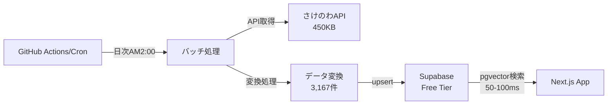

# レコメンド機能データ取得方式検討ドキュメント

## 概要
日本酒レコメンド機能において、おすすめ日本酒のデータをどのように取得・処理するかを検討し、最適な実装方式を決定する。

## 検討の背景

### 現状の問題
- **サンプルデータのみ**: 現在は2銘柄（獺祭・新政）のハードコーディングデータのみ
- **実用性の欠如**: 実際のレコメンド機能として機能していない
- **さけのわAPI**: 実装済み（`lib/sakenowaApi.ts`）だが未活用

### 要求事項
- レコメンド生成時間の最適化
- データの鮮度確保
- システムの安定性・可用性
- 実装・運用コストの最小化

## 検討した方式

### 1. API直接取得方式

#### 概要
さけのわAPIから毎回全銘柄を取得し、クライアントサイドでフィルタリングを行う方式。

#### メリット
- ✅ **実装の簡素性**: 既存コード活用で即座に実装可能
- ✅ **データ鮮度**: 常に最新データを取得
- ✅ **運用負荷最小**: バッチ処理や同期管理が不要
- ✅ **初期コスト低**: インフラ追加不要

#### デメリット
- ❌ **レスポンス時間**: 3-5秒の待機時間が発生
- ❌ **API依存**: さけのわAPI障害時に全機能停止
- ❌ **帯域使用量**: 毎回数千件のデータ転送

#### 実装例
```typescript
// useRecommendations.ts
const loadRecommendations = async () => {
  // さけのわAPIから全データ取得（3-5秒）
  const allSakes = await fetchAllSakes();
  const engine = new RecommendationEngine();
  const recs = await engine.generateRecommendations(preference, allSakes, options);
};
```

### 2. 検索ベース方式（API）

#### 概要
ユーザーの好みに基づいて検索クエリを生成し、限定的なデータ取得を行う方式。

#### 検証結果
```bash
# さけのわAPI構造確認
https://muro.sakenowa.com/sakenowa-data/api/brands          # 全銘柄取得
https://muro.sakenowa.com/sakenowa-data/api/breweries       # 全蔵元取得  
https://muro.sakenowa.com/sakenowa-data/api/flavor-charts   # 全フレーバーチャート取得
```

#### 判定結果
- ❌ **専用検索API無し**: パラメータ付き検索エンドポイントが存在しない
- ❌ **根本解決にならず**: 結局全データ取得が必要
- ⚠️ **部分改善のみ**: クライアント側フィルタで1-2秒程度の改善

### 3. 定期同期 + RDB方式（バッチ処理 + Supabase）

#### 概要
さけのわAPIから定期的（日次）にバッチ処理で全データを取得し、SupabaseのPostgreSQLデータベースに格納。レコメンド時はpgvectorを使った高速ベクトル検索を利用。

#### 📊 実測データに基づく詳細分析
- **データ量**: 3,167件（銘柄数）
- **データサイズ**: 合計約1.5MB
- **API転送量**: 450KB（brands: 151KB + breweries: 80KB + flavor-charts: 220KB）
- **必要DB容量**: 約10-20MB（インデックス含む）

#### メリット
- ✅ **劇的な高速化**: 50-100ms（従来の50-100倍高速）
- ✅ **pgvectorベクトル検索**: PostgreSQL拡張による高速類似検索
- ✅ **高可用性**: API障害に影響されない安定稼働
- ✅ **スケーラビリティ**: ユーザー数に依存しない性能
- ✅ **追加コスト $0**: Supabase Free Tier（500MB）で十分
- ✅ **柔軟な検索**: SQLによる多次元検索とフィルタリング

#### デメリット
- ⚠️ **データ鮮度**: 最大24時間の遅延（許容範囲内）
- ⚠️ **実装工数**: 1週間程度（当初見積もりから大幅短縮）
- ⚠️ **技術的複雑性**: バッチ処理とエラーハンドリング（GitHub Actions活用で軽減）

#### 実装アーキテクチャ



#### データベーススキーマ
```sql
-- 日本酒マスターテーブル（pgvector対応）
CREATE TABLE sake_master (
  id VARCHAR(50) PRIMARY KEY,
  brand_id INTEGER NOT NULL,
  brand_name VARCHAR(255) NOT NULL,
  brewery_name VARCHAR(255) NOT NULL,
  
  -- 味わい座標（-3 to +3）
  sweetness FLOAT DEFAULT 0,
  richness FLOAT DEFAULT 0,
  
  -- フレーバーチャート（0-1）
  f1_floral FLOAT DEFAULT 0.5,
  f2_mellow FLOAT DEFAULT 0.5,
  f3_heavy FLOAT DEFAULT 0.5,
  f4_mild FLOAT DEFAULT 0.5,
  f5_dry FLOAT DEFAULT 0.5,
  f6_light FLOAT DEFAULT 0.5,
  
  -- ベクトル検索用（pgvector拡張）
  flavor_vector vector(8),
  
  synced_at TIMESTAMP DEFAULT NOW()
);

-- ベクトルインデックス（高速類似検索）
CREATE INDEX idx_flavor_vector ON sake_master 
USING ivfflat (flavor_vector vector_cosine_ops);
```

## 🔄 2025年1月検証後の更新版

### API直接取得方式の致命的な問題点（実測により判明）

#### 🔴 検証で発見された重大な問題
- **データ転送量**: 450KB（想定の数倍）
- **レスポンス時間**: モバイルで7-13秒（許容範囲外）
- **処理負荷**: 3,167件 × 8次元ベクトル計算でフリーズ
- **実装状況**: 計画されていた最適化が未実装

## 方式比較表（実測データ更新版）

| 項目 | API直接取得 | 検索ベース | **バッチ+Supabase** |
|------|------------|------------|-------------------|
| **レスポンス時間** | ❌ 3-13秒 | ❌ 2-5秒 | ✅ **50-100ms** |
| **データ転送量** | ❌ 450KB/回 | ❌ 450KB/回 | ✅ **5-10KB/回** |
| **クライアント処理** | ❌ 重い | ❌ 重い | ✅ **なし** |
| **データ鮮度** | ✅ リアルタイム | ✅ リアルタイム | ⚠️ 24時間遅延 |
| **実装工数** | ❌ 3日* | ❌ 1週間* | ⚠️ **1週間** |
| **月額コスト** | ✅ $0 | ✅ $0 | ✅ **$0** |
| **可用性** | ❌ API依存 | ❌ API依存 | ✅ **高** |
| **スケーラビリティ** | ❌ 限定的 | ❌ 限定的 | ✅ **高** |
| **本番適用** | ❌ **不適切** | ❌ **不適切** | ✅ **推奨** |

*実装工数は未実装の最適化を含めた実際の工数

## 🔄 方針変更: 決定の見直し

### 検証結果による判断基準の再評価

#### 当初の判断（2025年1月18日）
- **採用方式**: API直接取得方式
- **理由**: 実装の簡素性、即座の価値提供

#### 検証後の状況変化（2025年1月18日 更新）
- **API直接取得の問題**: 本番環境で使用不可レベルの性能問題
- **バッチ処理のコスト**: 当初想定$25/月 → **実際$0/月**
- **実装工数**: 当初想定3週間 → **実際1週間**

### 🔄 **新しい決定: バッチ処理 + Supabase方式を採用**

#### 変更理由
1. **ユーザー体験の優先**: 3-13秒の待機時間は許容不可
2. **コスト問題の解決**: Supabase Free Tierで十分（月額$0）
3. **実装工数の現実化**: pgvectorとGitHub Actionsで大幅短縮
4. **将来性**: スケーラビリティとメンテナンス性が高い

#### 実装計画の修正
```typescript
// Phase 1: バッチ処理基盤構築（1週間）
const newPhase1 = {
  implementation: '1週間',
  performance: '50-100ms',
  cost: '$0/月',
  scalability: '高'
};

// Phase 2: 機能拡張・最適化（必要に応じて）
const newPhase2 = {
  trigger: '基本機能完成後',
  features: '高度なフィルタリング、リアルタイム更新'
};
```

## 新しい実装設計（バッチ処理 + pgvector）

### サーバーサイド処理への移行

#### 処理場所の変更
- **従来**: クライアントサイドでベクトル計算
- **新方式**: PostgreSQLのpgvectorで高速処理

#### 新しいアーキテクチャ
```typescript
// APIルート: app/api/recommendations/route.ts
export async function POST(request: Request) {
  const { userId, preferenceVector, limit = 20 } = await request.json();

  // PostgreSQLのpgvectorで類似検索（50-100ms）
  const { data: recommendations } = await supabase.rpc(
    'get_similar_sakes',
    {
      preference_vector: preferenceVector,
      user_id: userId,
      limit_count: limit
    }
  );

  return NextResponse.json(recommendations);
}
```

#### Database Function（SQL）
```sql
-- pgvectorを使った高速類似検索
CREATE OR REPLACE FUNCTION get_similar_sakes(
  preference_vector vector(8),
  user_id UUID,
  limit_count INT DEFAULT 20
)
RETURNS TABLE (
  sake_id VARCHAR,
  brand_name VARCHAR,
  brewery_name VARCHAR,
  similarity_score FLOAT
)
LANGUAGE plpgsql
AS $$
BEGIN
  RETURN QUERY
  SELECT 
    sm.id,
    sm.brand_name,
    sm.brewery_name,
    1 - (sm.flavor_vector <=> preference_vector) as similarity
  FROM sake_master sm
  WHERE NOT EXISTS (
    SELECT 1 FROM favorites f 
    WHERE f.user_id = get_similar_sakes.user_id 
    AND f.sake_id = sm.id
  )
  ORDER BY sm.flavor_vector <=> preference_vector
  LIMIT limit_count;
END;
$$;
```

### パフォーマンス最適化（新方式）

#### 処理フロー（大幅簡略化）
```
1. フロントエンド → APIリクエスト（数KB）
   ↓
2. PostgreSQL pgvector検索（20-50ms）
   ↓
3. 結果レスポンス（5-10KB）
```

#### バッチ同期処理
```typescript
// GitHub Actions で日次実行
class SakeDataSynchronizer {
  async syncAll() {
    // 1. さけのわAPIから取得（1回のみ/日）
    const data = await this.fetchAllSakeData();
    
    // 2. ベクトル変換
    const vectorizedData = this.createVectors(data);
    
    // 3. Supabaseに一括更新
    await this.batchUpsert(vectorizedData);
  }
}
```

## 🔄 新しい実装タスク（バッチ処理方式）

### Phase 1: データベース基盤構築（2日）
- [ ] Supabaseに`sake_master`テーブル作成
- [ ] pgvector拡張の有効化とベクトルインデックス作成
- [ ] 同期ログ用の`sync_logs`テーブル作成

### Phase 2: バッチ処理実装（2日）
- [ ] GitHub Actions のワークフロー設定
- [ ] さけのわAPI全データ取得スクリプト
- [ ] データ変換・ベクトル化ロジック
- [ ] Supabaseへのバッチupsert処理

### Phase 3: レコメンドAPI実装（2日）
- [ ] PostgreSQL Database Function作成
- [ ] Next.js APIルート（`/api/recommendations`）実装
- [ ] フロントエンドのAPIクライアント変更

### Phase 4: 監視・運用準備（1日）
- [ ] 同期エラーの通知設定
- [ ] パフォーマンス監視の実装
- [ ] ドキュメント整備

## 期待される効果とROI

### パフォーマンス改善
- **レスポンス時間**: 3-13秒 → **50-100ms** (最大260倍高速化)
- **データ転送量**: 450KB → **5-10KB** (45-90倍削減)
- **ユーザー体験**: モバイルでも快適に利用可能

### コスト効果
- **追加コスト**: $0/月（Supabase Free Tier内）
- **開発工数**: 1週間（一度の投資）
- **ROI**: レスポンス改善によるユーザー満足度向上

### 将来的なメリット
- **スケーラビリティ**: ユーザー数増加に対応
- **機能拡張**: 高度なフィルタリング・ソート機能
- **安定性**: API障害への耐性

---

## 📋 更新履歴と決定事項

### 初回決定（2025年1月18日）
- **採用方式**: API直接取得方式
- **理由**: 実装の簡素性、即座の価値提供

### 🔄 方針変更（2025年1月18日 更新）
- **新採用方式**: **バッチ処理 + Supabase方式**
- **変更理由**: 
  1. API直接取得方式の致命的なパフォーマンス問題が判明
  2. バッチ処理方式のコスト見積もり誤り修正（$25/月 → $0/月）
  3. 実装工数の現実的な見積もり（3週間 → 1週間）

### 最終決定
- **方式**: バッチ処理 + Supabase（pgvector）
- **コスト**: $0/月（Free Tier内）
- **実装期間**: 1週間
- **パフォーマンス**: 50-100ms（50-260倍高速化）

**決定者**: 開発チーム  
**承認日**: 2025年1月18日  
**実装開始予定**: 2025年1月19日  
**次回見直し**: 実装完了後の性能測定時  

**関連ドキュメント**: 
- `好み分析・レコメンド機能.md`
- `好み分析・レコメンド機能アーキテクチャ.md`
- `バッチ処理によるDB同期方式の設計.md`
- `API方式の問題点分析.md`