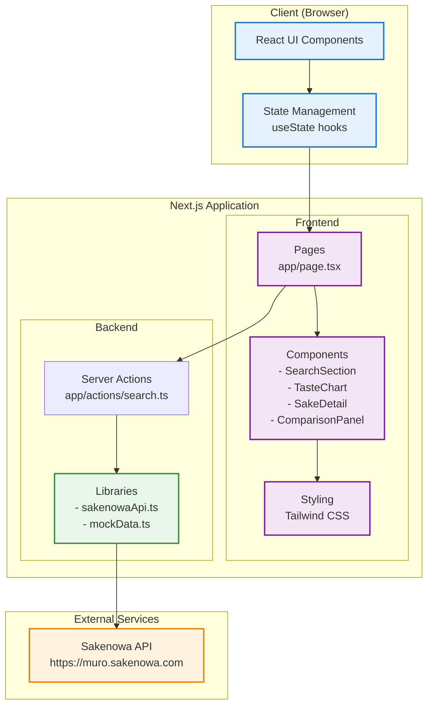
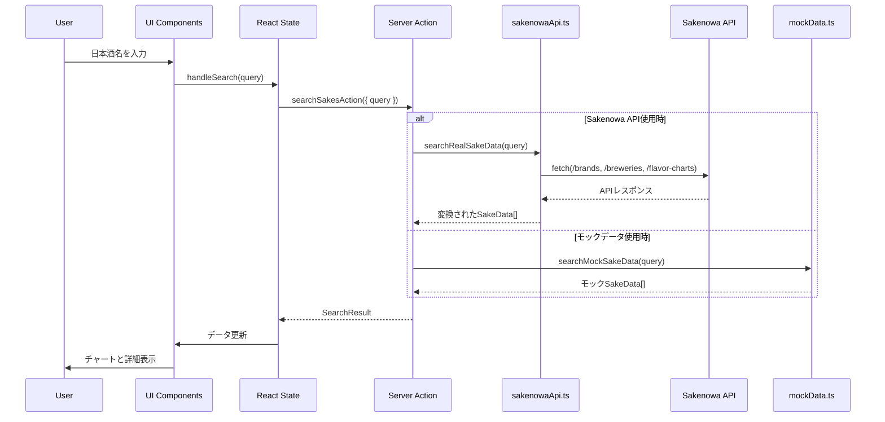
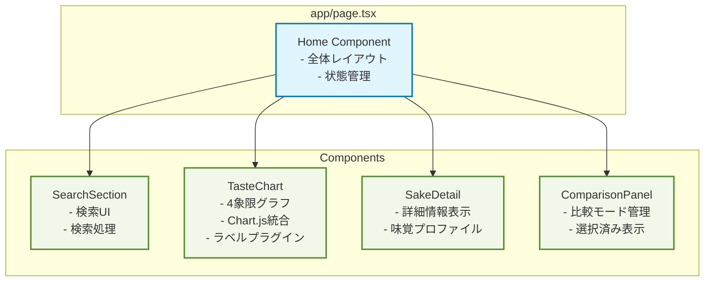
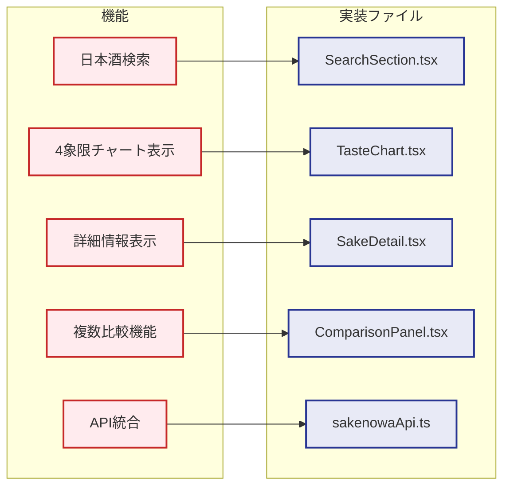
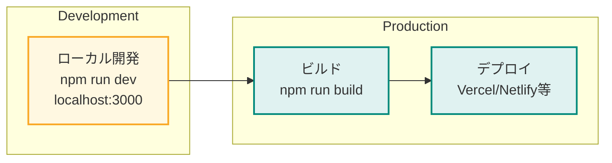

# 酒サーチ MVP アーキテクチャ図

## システム全体構成

## データフロー

## コンポーネント構成

## 主要な技術スタック

| レイヤー | 技術 | 用途 |
|---------|------|------|
| フレームワーク | Next.js 15.4.5 | SSR, API Routes, ルーティング |
| UI ライブラリ | React 19 | コンポーネントベースUI |
| 言語 | TypeScript | 型安全性 |
| スタイリング | Tailwind CSS | ユーティリティファーストCSS |
| グラフ描画 | Chart.js | 散布図による4象限チャート |
| 外部API | Sakenowa API | 日本酒データ取得 |
| 開発ツール | ESLint, PostCSS | コード品質, CSS処理 |

## 主要機能とファイル対応

## データ取得インターフェース

- Web(既定): Server Actions `searchSakesAction(options)` を利用
- 将来モバイル/BFF: `/api/v1/sakes/search` を追加して共通契約化（未実装）

## デプロイメント構成

## セキュリティ考慮事項

1. **環境変数管理**
   - `USE_SAKENOWA_API` - .env.localで管理
   - 本番環境では環境変数として設定

2. **CORS対策**
   - Next.js API Routesを経由してSakenowa APIにアクセス
   - クライアントから直接外部APIを呼ばない

3. **入力検証**
   - 検索クエリのサニタイゼーション
   - APIレスポンスの型検証

## パフォーマンス最適化

1. **キャッシュ戦略**
   - Sakenowa APIレスポンスを1時間キャッシュ
   - `next: { revalidate: 3600 }`

2. **バンドルサイズ**
   - Chart.jsの必要なモジュールのみインポート
   - 動的インポートは現状未使用

3. **レンダリング最適化**
   - React 19の最適化機能を活用
   - 不要な再レンダリングを防ぐ状態管理
