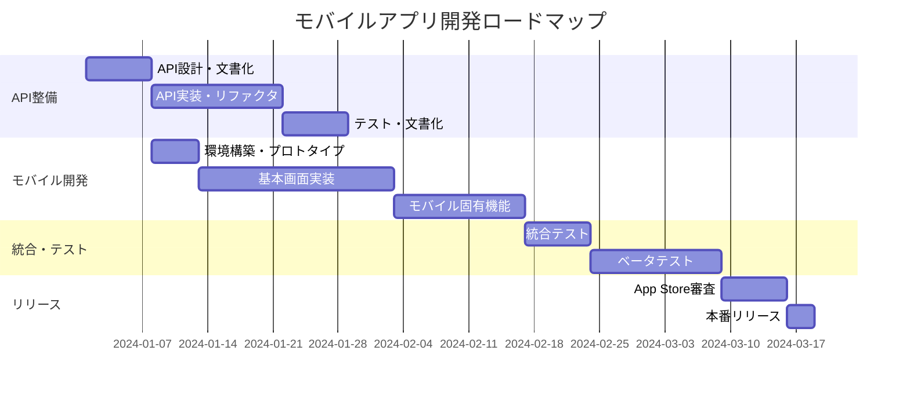

# モバイルアプリ対応アーキテクチャ設計書

## 概要

日本酒検索アプリ「Sake Search」のモバイルアプリ対応に向けた包括的なアーキテクチャ設計書です。既存のWebアプリケーション（Next.js）を維持しながら、段階的にiOS/Androidアプリに対応する方針を策定しています。

## 現状分析

### 現在のアーキテクチャ
- **フロントエンド**: Next.js (Web)
- **バックエンド**: Supabase + Next.js API Routes
- **認証**: Supabase Auth
- **データベース**: PostgreSQL (Supabase)
- **画像処理**: Gemini Vision API, Google Cloud Vision API, Tesseract.js

## 推奨アーキテクチャ: API-First設計

```
┌─────────────────┐     ┌─────────────────┐     ┌─────────────────┐
│   Web App       │     │  iOS App        │     │  Android App    │
│   (Next.js)     │     │  (React Native) │     │  (React Native) │
└────────┬────────┘     └────────┬────────┘     └────────┬────────┘
         │                       │                       │
         └───────────┬───────────┴───────────────────────┘
                     ↓
         ┌───────────────────────────────┐
         │      共通API Layer            │
         │   (RESTful / GraphQL)         │
         ├───────────────────────────────┤
         │  • 認証 (Supabase Auth)       │
         │  • データアクセス              │
         │  • ビジネスロジック           │
         │  • 画像処理                   │
         └───────────┬───────────────────┘
                     ↓
         ┌───────────────────────────────┐
         │     Supabase                  │
         │  (PostgreSQL + Storage)       │
         └───────────────────────────────┘
```

## 具体的な設計変更

### 1. API層の分離と強化

#### 現在のAPI構造
```
/api/
  ├── gemini-vision/
  ├── ocr/
  ├── recommendations/
  ├── restaurant/
  └── search/
```

#### 変更後のAPI構造
```typescript
/api/v1/
  ├── auth/              # 認証関連
  │   ├── login/
  │   ├── logout/
  │   ├── refresh/
  │   └── user/
  ├── sakes/             # 日本酒CRUD
  │   ├── search/
  │   ├── {id}/
  │   ├── favorites/
  │   └── trending/
  ├── records/           # 記録管理
  │   ├── drinking/
  │   ├── restaurant/
  │   └── statistics/
  ├── restaurants/       # 飲食店管理
  │   ├── menus/
  │   ├── recommendations/
  │   └── nearby/
  ├── recommendations/   # レコメンド
  │   ├── personal/
  │   ├── trending/
  │   └── restaurant-based/
  ├── ocr/              # OCR処理
  │   ├── menu-scan/
  │   ├── batch/
  │   └── history/
  └── sync/             # データ同期
      ├── offline-queue/
      └── device-state/
```

### 2. 共通ビジネスロジックの切り出し

```typescript
// packages/core/ または libs/core/
├── services/
│   ├── SakeService.ts           # 日本酒データ操作
│   ├── RecordService.ts         # 記録管理
│   ├── RestaurantService.ts     # 飲食店管理
│   ├── RecommendationService.ts # レコメンドエンジン
│   ├── OCRService.ts           # OCR処理
│   └── SyncService.ts          # データ同期
├── models/
│   ├── Sake.ts                 # 日本酒モデル
│   ├── Record.ts               # 記録モデル
│   ├── Restaurant.ts           # 飲食店モデル
│   ├── User.ts                 # ユーザーモデル
│   └── Recommendation.ts       # レコメンドモデル
├── utils/
│   ├── validators.ts           # バリデーション
│   ├── formatters.ts          # データフォーマッター
│   ├── constants.ts           # 定数
│   └── helpers.ts             # ヘルパー関数
└── types/
    ├── api.ts                 # API型定義
    ├── mobile.ts              # モバイル専用型
    └── common.ts              # 共通型定義
```

### 3. モバイル対応のデータ設計

#### レスポンス最適化
```typescript
interface MobileOptimizedResponse<T> {
  data: T;
  pagination?: {
    page: number;
    limit: number;
    total: number;
    hasNext: boolean;
    hasPrev: boolean;
  };
  cache?: {
    etag: string;
    maxAge: number;
    lastModified: string;
  };
  metadata?: {
    version: string;
    timestamp: string;
    source: 'cache' | 'live' | 'offline';
  };
}

interface ErrorResponse {
  error: {
    code: string;
    message: string;
    details?: any;
  };
  requestId: string;
  timestamp: string;
}
```

#### オフライン対応のキューシステム
```typescript
interface OfflineQueueItem {
  id: string;
  userId: string;
  actionType: 'CREATE' | 'UPDATE' | 'DELETE';
  resource: 'sake' | 'record' | 'restaurant';
  payload: any;
  timestamp: string;
  retryCount: number;
  status: 'pending' | 'failed' | 'synced';
}
```

## 実装アプローチ（段階的移行）

### Phase 1: API統一化 (1-2週間)
- [ ] 既存のAPI Routesを整理・統一
- [ ] OpenAPI 3.0仕様書の作成
- [ ] APIバージョニング導入（/api/v1/）
- [ ] エラーハンドリングの統一
- [ ] レスポンス形式の標準化

### Phase 2: React Native アプリ開発 (4-6週間)

#### プロジェクト構成
```typescript
sake-search-mobile/
├── src/
│   ├── screens/           # 画面コンポーネント
│   │   ├── SearchScreen/
│   │   ├── RecordsScreen/
│   │   ├── RestaurantScreen/
│   │   ├── FavoritesScreen/
│   │   └── ProfileScreen/
│   ├── components/        # 共有コンポーネント
│   │   ├── SakeCard/
│   │   ├── RecordForm/
│   │   ├── CameraScanner/
│   │   └── common/
│   ├── services/          # API通信
│   │   ├── api.ts
│   │   ├── auth.ts
│   │   ├── storage.ts
│   │   └── sync.ts
│   ├── hooks/             # カスタムフック
│   │   ├── useAuth.ts
│   │   ├── useSakeSearch.ts
│   │   ├── useRecords.ts
│   │   └── useOffline.ts
│   ├── store/             # 状態管理
│   │   ├── slices/
│   │   └── store.ts
│   ├── navigation/        # ナビゲーション
│   │   ├── AppNavigator.tsx
│   │   ├── AuthNavigator.tsx
│   │   └── TabNavigator.tsx
│   ├── utils/             # ユーティリティ
│   └── constants/         # 定数
├── assets/                # 静的ファイル
├── android/               # Android設定
├── ios/                   # iOS設定
├── app.json               # Expo設定
└── package.json
```

### Phase 3: 共通機能の最適化 (2-3週間)
- [ ] 画像最適化（モバイル用サイズ・圧縮）
- [ ] オフライン対応の実装
- [ ] プッシュ通知システム
- [ ] バックグラウンド同期
- [ ] パフォーマンス最適化

## モバイル特有の機能追加

### 1. カメラ・OCR機能の強化
```typescript
interface MobileCameraFeatures {
  realTimeScanning: {
    enabled: boolean;
    detectionThreshold: number;
    autoCapture: boolean;
  };
  batchProcessing: {
    maxImages: number;
    compressionQuality: number;
    parallelProcessing: boolean;
  };
  offlineOCR: {
    enabled: boolean;
    fallbackModel: string;
  };
}
```

### 2. 位置情報機能
```typescript
interface LocationFeatures {
  nearbyRestaurants: {
    enabled: boolean;
    radius: number; // meters
    caching: boolean;
  };
  geoTaggedRecords: {
    enabled: boolean;
    precision: 'exact' | 'approximate';
    privacy: 'private' | 'friends' | 'public';
  };
  locationHistory: {
    enabled: boolean;
    retentionDays: number;
  };
}
```

### 3. オフライン機能
```typescript
interface OfflineFeatures {
  dataSync: {
    autoSync: boolean;
    syncOnWiFiOnly: boolean;
    conflictResolution: 'client' | 'server' | 'manual';
  };
  caching: {
    maxCacheSize: number; // MB
    cacheDuration: number; // hours
    priorityData: string[]; // 優先キャッシュデータ
  };
  offlineQueue: {
    maxQueueSize: number;
    retryAttempts: number;
    retryBackoff: 'linear' | 'exponential';
  };
}
```

### 4. プッシュ通知
```typescript
interface NotificationFeatures {
  types: {
    newRecommendations: boolean;
    restaurantUpdates: boolean;
    friendActivity: boolean;
    systemUpdates: boolean;
  };
  scheduling: {
    dailySummary: {
      enabled: boolean;
      time: string; // "19:00"
    };
    weeklyReport: {
      enabled: boolean;
      day: number; // 0=Sunday
      time: string;
    };
  };
  personalization: {
    basedOnUsage: boolean;
    quietHours: {
      start: string;
      end: string;
    };
  };
}
```

## 技術スタック提案

### Option A: React Native + Expo (推奨)

#### メリット
- 既存のReactの知識を活用可能
- TypeScriptコードの共有が容易
- 開発速度が速い
- Expo Managed Workflowで開発・デプロイが簡単

#### 技術構成
```json
{
  "mobile": {
    "framework": "React Native 0.74 + Expo SDK 51",
    "navigation": "React Navigation 7",
    "state": "Redux Toolkit + RTK Query",
    "ui": "NativeBase 3.4 / Tamagui",
    "camera": "Expo Camera",
    "storage": "AsyncStorage + SQLite",
    "networking": "Axios + React Query",
    "notifications": "Expo Notifications",
    "analytics": "Expo Analytics"
  }
}
```

### Option B: Flutter (代替案)

#### メリット
- 高いパフォーマンス
- 一貫したUI表現
- ホットリロード開発体験

#### 技術構成
```yaml
mobile:
  framework: Flutter 3.16
  state: Riverpod 2.4
  api: Dio 5.3
  database: Drift 2.13
  ui: Material 3
  camera: camera 0.10
  storage: Hive 2.2
```

## データベース設計の追加

### モバイル対応テーブル

```sql
-- デバイス・セッション管理
CREATE TABLE mobile_sessions (
  id UUID PRIMARY KEY DEFAULT gen_random_uuid(),
  user_id UUID REFERENCES users(id) ON DELETE CASCADE,
  device_id TEXT NOT NULL,
  device_name TEXT,
  platform TEXT CHECK (platform IN ('ios', 'android')),
  app_version TEXT NOT NULL,
  os_version TEXT,
  push_token TEXT,
  last_sync TIMESTAMP WITH TIME ZONE,
  last_active TIMESTAMP WITH TIME ZONE DEFAULT NOW(),
  created_at TIMESTAMP WITH TIME ZONE DEFAULT NOW(),
  
  UNIQUE(user_id, device_id)
);

-- オフライン同期キュー
CREATE TABLE offline_queue (
  id UUID PRIMARY KEY DEFAULT gen_random_uuid(),
  user_id UUID REFERENCES users(id) ON DELETE CASCADE,
  device_id TEXT NOT NULL,
  action_type TEXT CHECK (action_type IN ('CREATE', 'UPDATE', 'DELETE')),
  resource_type TEXT NOT NULL,
  resource_id TEXT,
  payload JSONB NOT NULL,
  priority INTEGER DEFAULT 0,
  retry_count INTEGER DEFAULT 0,
  max_retries INTEGER DEFAULT 3,
  status TEXT CHECK (status IN ('pending', 'processing', 'completed', 'failed')) DEFAULT 'pending',
  error_message TEXT,
  created_at TIMESTAMP WITH TIME ZONE DEFAULT NOW(),
  processed_at TIMESTAMP WITH TIME ZONE,
  
  INDEX(user_id, status, created_at),
  INDEX(device_id, status)
);

-- アプリ設定・プリファレンス
CREATE TABLE mobile_preferences (
  id UUID PRIMARY KEY DEFAULT gen_random_uuid(),
  user_id UUID REFERENCES users(id) ON DELETE CASCADE,
  device_id TEXT NOT NULL,
  settings JSONB NOT NULL DEFAULT '{}',
  updated_at TIMESTAMP WITH TIME ZONE DEFAULT NOW(),
  
  UNIQUE(user_id, device_id)
);

-- プッシュ通知履歴
CREATE TABLE notification_history (
  id UUID PRIMARY KEY DEFAULT gen_random_uuid(),
  user_id UUID REFERENCES users(id) ON DELETE CASCADE,
  device_id TEXT,
  notification_type TEXT NOT NULL,
  title TEXT NOT NULL,
  body TEXT NOT NULL,
  payload JSONB,
  sent_at TIMESTAMP WITH TIME ZONE DEFAULT NOW(),
  opened_at TIMESTAMP WITH TIME ZONE,
  status TEXT CHECK (status IN ('sent', 'delivered', 'opened', 'failed')) DEFAULT 'sent',
  
  INDEX(user_id, sent_at DESC)
);
```

### インデックス・パフォーマンス最適化

```sql
-- モバイルアプリでよく使用されるクエリ用のインデックス
CREATE INDEX idx_drinking_records_user_recent ON drinking_records(user_id, date DESC);
CREATE INDEX idx_restaurant_menus_location ON restaurant_menus USING GIN(location gin_trgm_ops);
CREATE INDEX idx_sake_master_search ON sake_master USING GIN(
  (brand_name || ' ' || brewery_name) gin_trgm_ops
);

-- 部分インデックス（アクティブなデータのみ）
CREATE INDEX idx_mobile_sessions_active ON mobile_sessions(user_id, last_active) 
WHERE last_active > NOW() - INTERVAL '30 days';
```

## APIセキュリティ設計

### 認証・認可
```typescript
interface SecurityMeasures {
  authentication: {
    method: 'JWT (Supabase Auth)';
    tokenRefresh: 'Automatic refresh with refresh tokens';
    biometric: 'Touch ID / Face ID support';
  };
  authorization: {
    rbac: 'Role-Based Access Control';
    deviceBinding: 'Device-specific tokens';
    rateLimit: {
      requests: 100;
      window: '15 minutes';
      burst: 20;
    };
  };
  encryption: {
    transport: 'HTTPS/TLS 1.3 only';
    storage: 'AES-256 encrypted local storage';
    keyManagement: 'Keychain (iOS) / Keystore (Android)';
  };
  privacyProtection: {
    dataMinimization: 'Collect only necessary data';
    anonymization: 'Anonymous usage analytics';
    retention: 'Auto-delete after 2 years';
  };
}
```

### API Rate Limiting
```typescript
// Rate limiting configuration
interface RateLimitConfig {
  global: { requests: 1000, window: '1h' };
  perUser: { requests: 100, window: '15m' };
  perDevice: { requests: 200, window: '15m' };
  perEndpoint: {
    '/api/v1/search': { requests: 50, window: '1m' };
    '/api/v1/ocr': { requests: 10, window: '1m' };
    '/api/v1/recommendations': { requests: 20, window: '5m' };
  };
}
```

## 開発ロードマップ

### Timeline Overview


### 詳細スケジュール

#### Week 1-2: API設計・整備
- [ ] OpenAPI 3.0仕様書作成
- [ ] 既存API Routesのリファクタリング
- [ ] エラーレスポンス統一
- [ ] バージョニング実装
- [ ] レート制限実装

#### Week 3-4: API実装・拡張
- [ ] モバイル対応エンドポイント追加
- [ ] オフライン同期API
- [ ] プッシュ通知API
- [ ] 位置情報API
- [ ] バッチ処理API

#### Week 5-6: モバイルアプリ基盤
- [ ] React Native + Expo環境構築
- [ ] 基本ナビゲーション実装
- [ ] 認証フロー実装
- [ ] API連携基盤構築
- [ ] 状態管理セットアップ

#### Week 7-10: 主要機能実装
- [ ] 日本酒検索機能
- [ ] 記録機能
- [ ] 飲食店機能
- [ ] OCR・カメラ機能
- [ ] お気に入り・レコメンド機能

#### Week 11-12: モバイル最適化
- [ ] オフライン対応
- [ ] プッシュ通知
- [ ] 位置情報連携
- [ ] パフォーマンス最適化
- [ ] UI/UX調整

#### Week 13-14: テスト・リリース準備
- [ ] 統合テスト
- [ ] E2Eテスト
- [ ] ベータユーザーテスト
- [ ] ストア申請準備
- [ ] ドキュメント整備

## 推奨する次のステップ

### 1. API仕様策定 (優先度: 高)
```typescript
// 1. OpenAPI 3.0仕様書の作成
// docs/api/openapi.yaml

// 2. API Mock Server のセットアップ
// Prism や MSW を使用してモックAPI作成

// 3. フロントエンド・モバイル両方で共通のAPI型定義
// types/api.ts の統一化
```

### 2. 認証フロー統一 (優先度: 高)
```typescript
// Supabase Auth を完全活用
// - Social Login (Google, Apple)
// - Device Registration
// - Token Refresh
// - Biometric Authentication
```

### 3. React Nativeプロトタイプ (優先度: 中)
```typescript
// 主要画面3つでMVP作成:
// 1. 日本酒検索画面
// 2. 記録一覧画面  
// 3. OCRスキャン画面
```

### 4. 段階的リリース戦略 (優先度: 中)
```typescript
// Phase 1: Web API改修完了
// Phase 2: iOS/Android ベータ版
// Phase 3: 全機能リリース
// Phase 4: 高度な機能追加（AI、位置情報等）
```

## まとめ

この設計により、以下を実現できます：

1. **コードの再利用**: 既存のビジネスロジックを最大限活用
2. **段階的移行**: Webアプリを維持しながら徐々にモバイル対応
3. **スケーラビリティ**: 将来の機能拡張に対応可能な設計
4. **保守性**: 統一されたAPI・コード構造
5. **ユーザー体験**: モバイル特有の機能（カメラ、位置情報、通知）を活用

この文書は開発の進行に合わせて継続的に更新し、チーム全体で共有する生きたドキュメントとして運用することを推奨します。